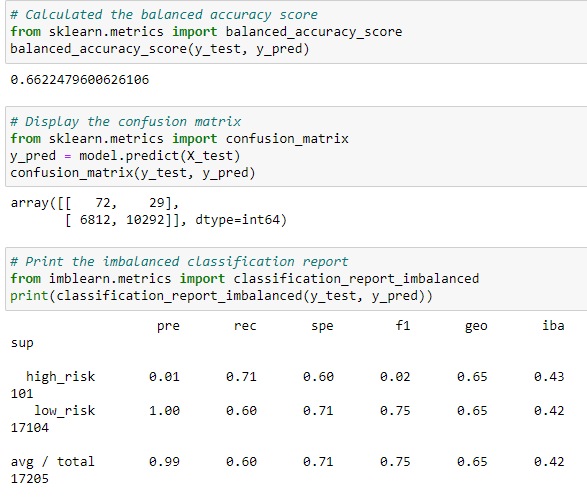
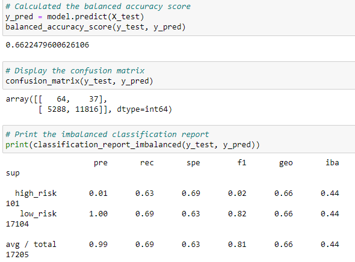
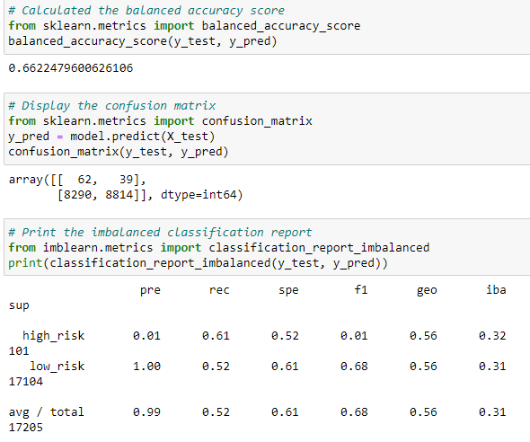
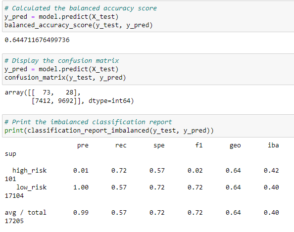
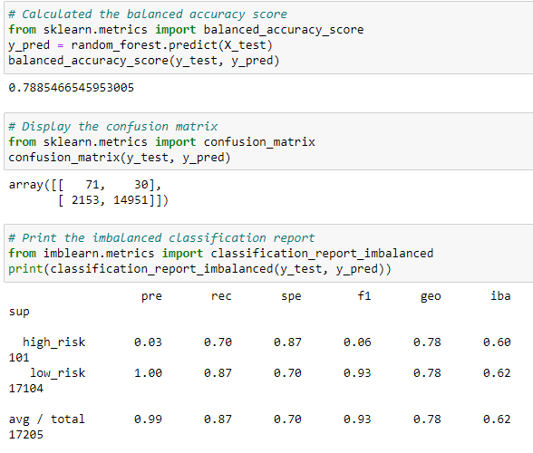
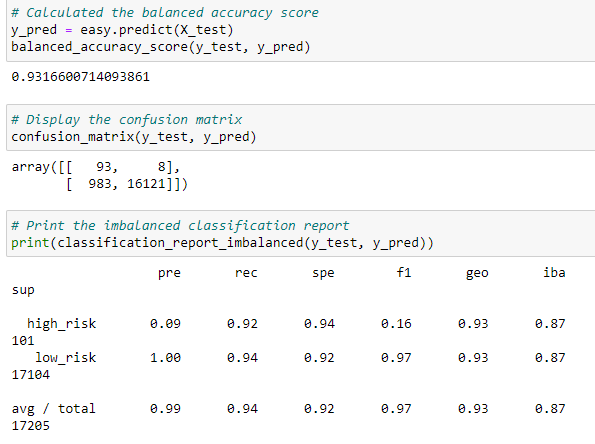

# Credit_Risk_Analysis
## Overview: 
Evaluating Credit Card risk using Michine Learning.  
Data from a peer-to-peer leading service company, LendingClub, is under- and oversampled using RandomOverSample, SMOTE, and ClusterCentroid algorithms. Then two machine learning models to reduce bias, BalancedRandomForestClassifer and EasyEsemberClassifer, are used to predict credit risk. 
## Results: 
### Naive Random Oversampling: 
* Accuracy score: 66.2%
* Precision score: 99%
* Recall: 60%

### SMOTE Oversampling: 
* Accuracy score: 66.2%
* Precision score: 99%
* Recall: 69%

### ClusterCentroids Undersampling: 
* Accuracy score: 66.2%
* Precision score: 99%
* Recall: 52%

### SMOTEENIN Under/Over Sampling Combo:
* Accuracy score: 64.5%
* Precision score: 99%
* Recall: 57%

### Balanced Random Forest Classifier:
* Accuracy score: 78.9%
* Precision score: 99%
* Recall: 87%

### Easy Ensemble AdaBoost Classifier:
* Accuracy score: 93.2%
* Precision score: 99%
* Recall: 94%

## Ranking: From Most to Least Accurate Predictions
1. Easy Ensemble AdaBoost Classifier
2. Balanced Random Forest Classifier
3. SMOTE
4. Naive
5. SMOOTEENIN
6. ClusterCentroids
## Summary
The above ranking is based on the accuracy score of each machine learning model. The Easy Essemble AdaBoost Classifier had the by far the most accurate score coming in at 93.2, in combination with it's high recall score of 94% it would be the best option of the six machine learning models. It is important to keep in mind that all models shows a precision score inidicating that scores are skewed toward the low risk loans. Overall, there could be improvments but my recommendation would be the Easy Essemble AdaBoost Classifier 
